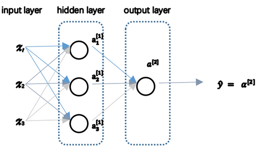

# 浅层神经网络

## 参考资料

【1】吴恩达，deep_learning.ai，第一周第三课，http://www.ai-start.com/dl2017/html/lesson1-week3.html


## 1 两层神经网络



> 在这里你所看到的这个例子，只能叫做一个两层的神经网络（上图）。原因是当我们计算网络的层数时，输入层是不算入总层数内，所以隐藏层是第一层，输出层是第二层。第二个惯例是我们将输入层称为第零层，所以在技术上，这仍然是一个三层的神经网络，因为这里有输入层、隐藏层，还有输出层。但是在传统的符号使用中，如果你阅读研究论文或者在这门课中，你会看到人们将这个神经网络称为一个两层的神经网络，因为我们不将输入层看作一个标准的层。


对于神经网络的第一层，给予一个输入$x$，得到$a^{[1]}$，$x$可以表示为$a^{[0]}$。通过相似的衍生你会发现，后一层的表示同样可以写成类似的形式，得到$a^{[2]}$，$\hat{y} = a^{[2]}$。


## 2 随机初始化

对于一个神经网络，如果你把权重或者参数都初始化为0，那么梯度下降将不会起作用。

> 有两个输入特征，$n^{[0]} = 2$，2个隐藏层单元$n^{[1]}$就等于2。 因此与一个隐藏层相关的矩阵，或者说$W^{[1]}$是2*2的矩阵，假设把它初始化为0的2*2矩阵，$b^{[1]}$也等于 $[0;0]^T$，把偏置项$b$初始化为0是合理的，但是把$w$初始化为0就有问题了。 那这个问题如果按照这样初始化的话，你总是会发现$a_{1}^{[1]}$ 和 $a_{2}^{[1]}$相等，这个激活单元和这个激活单元就会一样。因为两个隐含单元计算同样的函数，当你做反向传播计算时，这会导致$\text{dz}*{1}^{[1]}$ 和 $\text{dz}*{2}^{[1]}$也会一样，对称这些隐含单元会初始化得一样，这样输出的权值也会一模一样，由此$W^{[2]}$等于$[0;0]​$；


如果你要初始化成0，由于所有的隐含单元都是对称的，无论你运行梯度下降多久，他们一直计算同样的函数。这没有任何帮助，因为你想要两个不同的隐含单元计算不同的函数，这个问题的解决方法就是随机初始化参数。

```Python
W1 = np.random.randn(2,2)*0.01
b1 = np.zeros((2,1))

W2 = np.random.randn(1,2)*0.01
b2 = 0
```

