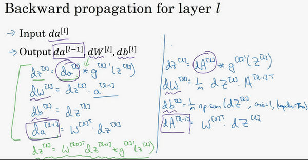

# 深层神经网络

## 参考资料

【1】吴恩达，deep_learning.ai，第一周第四课，http://www.ai-start.com/dl2017/html/lesson1-week4.html

## 1 计算流程图

## 2 前向传播和反向传播

### 2.1 前向传播步骤

.png)

.png)

.png)

### 2.2 反向传播步骤

.png)

.png)

### 2.3 向量计算

