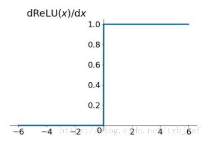

# 激活函数

## 参考资料：

【1】[百度百科](https://baike.baidu.com/item/激活函数)

【2】StevenSun2014，CSDN，https://blog.csdn.net/tyhj_sf/article/details/79932893

## 1 激活函数介绍

在神经元中，输入的 inputs 函数，这个函数就是激活函数。引入激活函数是为了增加神经网络模型的非线性。没有激活函数的每层都相当于矩阵相乘。就算你叠加了若干层之后，无非还是个矩阵相乘罢了。

> 如果不用激励函数（其实相当于激励函数是f(x) = x），在这种情况下你每一层节点的输入都是上层输出的线性函数，很容易验证，无论你神经网络有多少层，输出都是输入的线性组合，与没有隐藏层效果相当，这种情况就是最原始的感知机（Perceptron）了，那么网络的逼近能力就相当有限。正因为上面的原因，我们决定引入非线性函数作为激励函数，这样深层神经网络表达能力就更加强大（不再是输入的线性组合，而是几乎可以逼近任意函数）。

## 2 Sigmoid函数

Sigmoid函数常被用作神经网络的阈值函数，将变量映射到0,1之间。公式如下：

Sigmoid函数之前很常用，近年来很少用到了，主要是因为它固有的一些 缺点。

> **缺点1：在深度神经网络中梯度反向传递时导致梯度爆炸和梯度消失，其中梯度爆炸发生的概率非常小，而梯度消失发生的概率比较大。首先来看Sigmoid函数的导数，如下图所示**

> 如果我们初始化神经网络的权值为 [0,1] 之间的随机值，由反向传播算法的数学推导可知，梯度从后向前传播时，每传递一层梯度值都会减小为原来的0.25倍，如果神经网络隐层特别多，那么梯度在穿过多层后将变得非常小接近于0，即出现梯度消失现象；当网络权值初始化为 (1,+∞) 区间内的值，则会出现梯度爆炸情况。

> 缺点2：Sigmoid 的 output 不是0均值（即zero-centered）。这是不可取的，因为这会导致后一层的神经元将得到上一层输出的非0均值的信号作为输入。 产生的一个结果就是：如 x>0, f=wT*x+b,那么对w求局部梯度则都为正，这样在反向传播的过程中 w 要么都往正方向更新，要么都往负方向更新，导致有一种捆绑的效果，使得收敛缓慢。 当然了，如果按 batch 去训练，那么那个batch可能得到不同的信号，所以这个问题还是可以缓解一下的。因此，非0均值这个问题虽然会产生一些不好的影响，不过跟上面提到的梯度消失问题相比还是要好很多的。

> 缺点3：其解析式中含有幂运算，计算机求解时相对来讲比较耗时。对于规模比较大的深度网络，这会较大地增加训练时间。

## 3 Tanh函数

Tanh是双曲函数中的一个，Tanh()为双曲正切。在数学中，双曲正切“Tanh”是由基本双曲函数双曲正弦和双曲余弦推导而来。

> tanh读作Hyperbolic Tangent，它解决了Sigmoid函数的不是zero-centered输出问题，然而，梯度消失（gradient vanishing）的问题和幂运算的问题仍然存在。

## 4 ReLU函数

Relu激活函数（The Rectified Linear Unit），用于隐层神经元输出。公式如下

<figure class="half">
    
    
</figure>

> 优点：
> 1） 解决了gradient vanishing问题 (在正区间)
> 2）计算速度非常快，只需要判断输入是否大于0
> 3）收敛速度远快于sigmoid和tanh

> 注意的问题：
> 1）ReLU的输出不是zero-centered
> 2）Dead ReLU Problem，指的是某些神经元可能永远不会被激活，导致相应的参数永远不能被更新。

## 5 Leaky ReLU函数

> 为了解决Dead ReLU Problem，提出了将ReLU的前半段设为 αx 而非0，通常α=0.01。