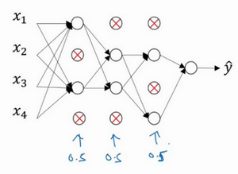

# 正则化

深度学习可能存在过拟合问题——高方差，有两个解决方法，一个是正则化，另一个是准备更多的数据。

## 参考资料

【1】吴恩达，deep_learning.ai，第二周第一课，http://www.ai-start.com/dl2017/html/lesson2-week1.html

## 1 L2 正则化

### 1.1 LR 正则化

### 1.2 NN正则化

## 2 为什么正则化有利于预防过拟合呢？

左图是高偏差，右图是高方差，中间是**Just Right**。

> 直观上理解就是如果正则化 **𝛌** 设置得足够大，权重矩阵 **𝛚** 被设置为接近于0的值，直观理解就是把多隐藏单元的权重设为0，于是基本上消除了这些隐藏单元的许多影响。如果是这种情况，这个被大大简化了的神经网络会变成一个很小的网络，小到如同一个逻辑回归单元，可是深度却很大，它会使这个网络从过度拟合的状态更接近左图的高偏差状态。
>
> 但是 **𝛌** 会存在一个中间值，于是会有一个接近“**Just Right**”的中间状态。
>
> 直观理解就是增加 **𝛌** 到足够大， **𝛚** 会接近于0，实际上是不会发生这种情况的，我们尝试消除或至少减少许多隐藏单元的影响，最终这个网络会变得更简单，这个神经网络越来越接近逻辑回归，我们直觉上认为大量隐藏单元被完全消除了，其实不然，实际上是该神经网络的所有隐藏单元依然存在，但是它们的影响变得更小了。神经网络变得更简单了，貌似这样更不容易发生过拟合，因此我不确定这个直觉经验是否有用，不过在编程中执行正则化时，你实际看到一些方差减少的结果。

## 3 dropout 正则化

**dropout**会遍历网络的每一层，并设置消除神经网络中节点的概率。假设网络中的每一层，每个节点都以抛硬币的方式设置概率，每个节点得以保留和消除的概率都是0.5，设置完节点概率，我们会消除一些节点，然后删除掉从该节点进出的连线，最后得到一个节点更少，规模更小的网络，然后用**backprop**方法进行训练。

> **dropout**一大缺点就是代价函数 **J** 不再被明确定义，每次迭代，都会随机移除一些节点，如果再三检查梯度下降的性能，实际上是很难进行复查的。定义明确的代价函数 **J** 每次迭代后都会下降，因为我们所优化的代价函数 **J** 实际上并没有明确定义，或者说在某种程度上很难计算，所以我们失去了调试工具来绘制这样的图片。我通常会关闭**dropout**函数，将**keep-prob**的值设为1，运行代码，确保J函数单调递减。然后打开**dropout**函数，希望在**dropout**过程中，代码并未引入**bug**。

## 4 其他正则化方法

### 4.1 数据扩增

> 通过随意翻转和裁剪图片，我们可以增大数据集，额外生成假训练数据。和全新的，独立的猫咪图片数据相比，这些额外的假的数据无法包含像全新数据那么多的信息，但我们这么做基本没有花费，代价几乎为零，除了一些对抗性代价。以这种方式扩增算法数据，进而正则化数据集，减少过拟合比较廉价。

### 4.2 early stopping

**early stopping**的主要缺点就是你不能独立地处理这两个问题（优化代价函数 **J** 和不出现过拟合），因为提早停止梯度下降，也就是停止了优化代价函数 **J** ，因为现在你不再尝试降低代价函数 **J** ，所以代价函数 **J** 的值可能不够小，同时你又希望不出现过拟合，你没有采取不同的方式来解决这两个问题，而是用一种方法同时解决两个问题，这样做的结果是我要考虑的东西变得更复杂。

如果不用**early stopping**，另一种方法就是 **L2** 正则化，训练神经网络的时间就可能很长。我发现，这导致超级参数搜索空间更容易分解，也更容易搜索，但是缺点在于，你必须尝试很多正则化参数 **𝛌** 的值，这也导致搜索大量 **𝛌** 值的计算代价太高。

**Early stopping**的优点是，只运行一次梯度下降，你可以找出 **𝛚** 的较小值，中间值和较大值，而无需尝试 **L2** 正则化超级参数 **𝛌** 的很多值。 

