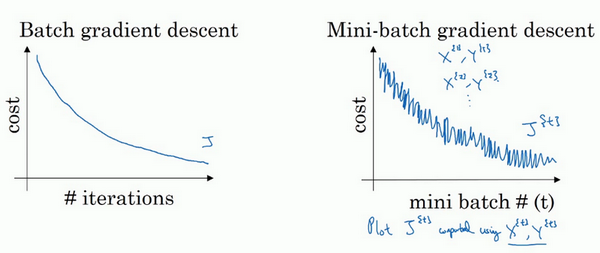
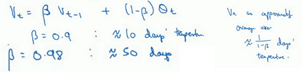

# 优化算法

优化算法能够帮助你快速训练模型。

## 参考资料

【1】吴恩达，deep_learning.ai，第二周第二课，http://www.ai-start.com/dl2017/html/lesson2-week2.html

## 1 Mini-batch 梯度下降

> 使用**batch**梯度下降法，一次遍历训练集只能让你做一个梯度下降，使用**mini-batch**梯度下降法，一次遍历训练集，能让你做5000个梯度下降。当然正常来说你想要多次遍历训练集，还需要为另一个**while**循环设置另一个**for**循环。所以你可以一直处理遍历训练集，直到最后你能收敛到一个合适的精度。
>

> 使用**batch**梯度下降法时，每次迭代你都需要历遍整个训练集，可以预期每次迭代成本都会下降，所以如果成本函数是迭代次数的一个函数，它应该会随着每次迭代而减少，如果在某次迭代中增加了，那肯定出了问题，也许你的学习率太大。

> 实际上你选择的**mini-batch**大小在二者之间，大小在1和**m**之间，而1太小了，**m**太大了，原因在于如果使用**batch**梯度下降法，**mini-batch**的大小为**m**，每个迭代需要处理大量训练样本，该算法的主要弊端在于特别是在训练样本数量巨大的时候，单次迭代耗时太长。如果训练样本不大，**batch**梯度下降法运行地很好。
>

> 相反，如果使用随机梯度下降法，如果你只要处理一个样本，那这个方法很好，这样做没有问题，通过减小学习率，噪声会被改善或有所减小，但随机梯度下降法的一大缺点是，你会失去所有向量化带给你的加速，因为一次性只处理了一个训练样本，这样效率过于低下，所以实践中最好选择不大不小的**mini-batch**尺寸，实际上学习率达到最快。你会发现两个好处，一方面，你得到了大量向量化，上个视频中我们用过的例子中，如果**mini-batch**大小为1000个样本，你就可以对1000个样本向量化，比你一次性处理多个样本快得多。另一方面，你不需要等待整个训练集被处理完就可以开始进行后续工作，再用一下上个视频的数字，每次训练集允许我们采取5000个梯度下降步骤，所以实际上一些位于中间的**mini-batch**大小效果最好。
> 

## 2 指数加权平均数

𝞡: 温度，𝞡1：第一天的温度

* v0 = 0
* v1 = 𝞫 X v0 + (1-𝞫) X 𝞡1
* v2 = 𝞫 X v1 + (1-𝞫) X 𝞡2
* ......
* vt = 𝞫 X vt + (1-𝞫) X 𝞡t

### 2.1 不同的 𝞫 值

 当 𝞫 = 0.9，计算十天的平均值，也就是红线部分。

 当 𝞫 = 0.98，计算五十天的平均值，也就是绿线部分。

 当 𝞫 = 0.5，计算两天的平均值，也就是黄线部分。由于仅平均了两天的温度，平均的数据太少，所以得到的曲线有更多的噪声，有可能出现异常值，但是这个曲线能够更快适应温度变化。

### 2.2 偏差修正

计算移动平均数的时候，初始化v0=0，v1 = 0.98v0+0.02𝞡1，但是v0=0，所以这部分没有了（0.98v0），因此得到的v1值会小很多，所以第一天温度的估测不准。

修正：vt = vt/(1-𝞫 ^t)

当t很小时，对vt进行修正；随着增加，𝞫 ^t接近于0，所以当 *t* 很大的时候，偏差修正几乎没有作用。

> 在机器学习中，在计算指数加权平均数的大部分时候，大家不在乎执行偏差修正，因为大部分人宁愿熬过初始时期，拿到具有偏差的估测，然后继续计算下去。如果你关心初始时期的偏差，在刚开始计算指数加权移动平均数的时候，偏差修正能帮助你在早期获取更好的估测。

## 3 动量梯度下降法

想象你有一个碗，你拿一个球，微分项给了这个球一个加速度，此时球正向山下滚，球因为加速度越滚越快，而因为 𝞫 稍小于1，表现出一些摩擦力，所以球不会无限加速下去，所以不像梯度下降法，每一步都独立于之前的步骤，你的球可以向下滚，获得动量，可以从碗向下加速获得动量。

## 4 RMSprop

在横轴方向或者在例子中的 **W** 方向，我们希望学习速度快，而在垂直方向，也就是例子中的 **b** 方向，我们希望减缓纵轴上的摆动，所以有了 **SdW** 和 **Sdb** ，我们希望会相对较小，所以我们要除以一个较小的数，而希望 **Sdb** 又较大，所以这里我们要除以较大的数字，这样就可以减缓纵轴上的变化。

## 5 Adam 优化算法

**Adam**优化算法（**Adaptive Moment Estimation**）基本上就是将**Momentum**和**RMSprop**结合在一起。

初始化：Vdw=0，Sdw=0，Vdb=0，Sdb=0

## 6 局部最优的问题

> 一个具有高维度空间的函数，如果梯度为0，那么在每个方向，它可能是凸函数，也可能是凹函数。如果你在2万维空间中，那么想要得到局部最优，所有的2万个方向都需要是这样，但发生的机率也许很小，也许是2^(-20000)，你更有可能遇到有些方向的曲线会这样向上弯曲，另一些方向曲线向下弯，而不是所有的都向上弯曲，因此在高维度空间，你更可能碰到鞍点。
>

> 首先，你不太可能困在极差的局部最优中，条件是你在训练较大的神经网络，存在大量参数，并且成本函数被定义在较高的维度空间。
>
> 第二点，平稳段是一个问题，这样使得学习十分缓慢，这也是像**Momentum**或是**RMSprop**，**Adam**这样的算法，能够加速学习算法的地方。在这些情况下，更成熟的优化算法，如**Adam**算法，能够加快速度，让你尽早往下走出平稳段。
>