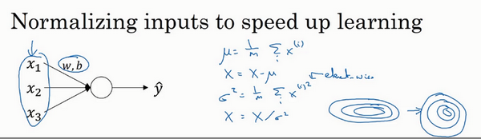

# Batch Norm

## 参考资料

【1】吴恩达，deep_learning.ai，第二周第三课，http://www.ai-start.com/dl2017/html/lesson2-week3.html

## 1 归一化网络的激活函数

当训练一个模型，比如logistic回归时，你也许会记得，归一化输入特征可以加快学习过程。你计算了平均值，从训练集中减去平均值，计算了方差，接着根据方差归一化你的数据集，在之前的视频中我们看到，这是如何把学习问题的轮廓，从很长的东西，变成更圆的东西，更易于算法优化。所以这是有效的，对logistic回归和神经网络的归一化输入特征值而言。

你不仅输入了特征值**x**，而且这层有激活值**a[1]**，这层有激活值**a[2]**等等。如果你想训练这些参数，比如**w[3]**，**b[3]**，那归一化**a[2]**的平均值和方差岂不是很好？以便使**w[3]**，**b[3]**的训练更有效率。

通过对 **𝛾** 和 **𝛽** 合理设定，规范化过程，即这四个等式，从根本来说，只是计算恒等函数，通过赋予 **𝛾** 和 **𝛽** 其它值，可以使你构造含其它平均值和方差的隐藏单元值。

## 2 将 Batch Norm 拟合进神经网络

每个单元负责计算两件事。第一，它先计算z，然后应用其到激活函数中再计算a。每个圆圈代表着两步的计算过程。同样的，对于下一层而言，那就是 **z1[2]** 和 **a1[2]** 等。所以如果你没有应用**Batch**归一化，你会把输入 **X** 拟合到第一隐藏层，然后首先计算 **z[1]** ，这是由 **w[1]** 和 **b[1]** 两个参数控制的。接着，通常而言，你会把 **z[1]** 拟合到激活函数以计算 **a[1]** 。但**Batch**归一化的做法是将 **z[1]** 值进行**Batch**归一化，简称**BN**，此过程将由 **𝛾[1]** 和 **𝛽[1]** 两参数控制，这一操作会给你一个新的规范化的值 **z[1]** ，然后将其输入激活函数中得到 **a[1]** ，即 **a[1] = g[1] (z[1])** 。

如果你在使用**Batch**归一化，其实你可以消除这个参数（**b[l]**），或者你也可以，暂时把它设置为0，那么，参数变成 **z[l] = w[l]a[l-1]** ，然后你计算归一化的 **z[l]** ，**z[l] = 𝛾[l]z[l]+𝛽[l]** ，你最后会用参数 **𝛽[l]** ，以便决定 **z[l]** 的取值。

**梯度计算：**

## 3 为什么**Batch**归一化会起作用呢？

> 一个原因是，你已经看到如何归一化输入特征值，使其均值为0，方差1，它又是怎样加速学习的，有一些从0到1而不是从1到1000的特征值，通过归一化所有的输入特征值，以获得类似范围的值，可以加速学习。所以**Batch**归一化起的作用的原因，直观的一点就是，它在做类似的工作，但不仅仅对于这里的输入值，还有隐藏单元的值。
>
> **Batch**归一化有效的第二个原因是，它可以使权重比你的网络更滞后或更深层，比如，第10层的权重更能经受得住变化，相比于神经网络中前层的权重，比如第1层。

**Batch**归一化减少了输入值改变的问题，它的确使这些值变得更稳定，神经网络的之后层就会有更坚实的基础。即使使输入分布改变了一些，它会改变得更少。它做的是当前层保持学习，当改变时，迫使后层适应的程度减小了，你可以这样想，它减弱了前层参数的作用与后层参数的作用之间的联系，它使得网络每层都可以自己学习，稍稍独立于其它层，这有助于加速整个网络的学习。

**Batch**归一化的意思是，尤其从神经网络后层之一的角度而言，前层不会左右移动的那么多，因为它们被同样的均值和方差所限制，所以，这会使得后层的学习工作变得更容易些。

**Batch**归一化还有一个作用，它有轻微的正则化效果。

> **Batch**归一化含几重噪音，因为标准偏差的缩放和减去均值带来的额外噪音。这里的均值和标准差的估计值也是有噪音的，所以类似于**dropout**，**Batch**归一化有轻微的正则化效果，因为给隐藏单元添加了噪音，这迫使后部单元不过分依赖任何一个隐藏单元，类似于**dropout**，它给隐藏层增加了噪音，因此有轻微的正则化效果。因为添加的噪音很微小，所以并不是巨大的正则化效果，你可以将**Batch**归一化和**dropout**一起使用，如果你想得到**dropout**更强大的正则化效果。
>
> 也许另一个轻微非直观的效果是，如果你应用了较大的**mini-batch**，对，比如说，你用了512而不是64，通过应用较大的**min-batch**，你减少了噪音，因此减少了正则化效果，这是**dropout**的一个奇怪的性质，就是应用较大的**mini-batch**可以减少正则化效果。

## 4 测试时的 Batch Norm

在训练时，这些就是用来执行**Batch**归一化的等式。在一个**mini-batch**中，你将**mini-batch**的 **z(i)** 值求和，计算均值，所以这里你只把一个**mini-batch**中的样本都加起来，我用m来表示这个**mini-batch**中的样本数量，而不是整个训练集。然后计算方差，再算 **z(i)norm** ，即用均值和标准差来调整，加上 **𝜀** 是为了数值稳定性。**z～(i)** 是用 **𝛾** 和 **𝛽** 和再次调整 **znorm** 得到的。

在典型的**Batch**归一化运用中，你需要用一个指数加权平均来估算，这个平均数涵盖了所有**mini-batch**。

在训练时，**𝜇** 和 **𝜎^2** 是在整个**mini-batch**上计算出来的包含了像是64或28或其它一定数量的样本，但在测试时，你可能需要逐一处理样本，方法是根据你的训练集估算 **𝜇** 和 **𝜎^2** ，估算的方式有很多种，理论上你可以在最终的网络中运行整个训练集来得到 **𝜇** 和 **𝜎^2** ，但在实际操作中，我们通常运用指数加权平均来追踪在训练过程中你看到的 **𝜇** 和 **𝜎^2** 的值。

