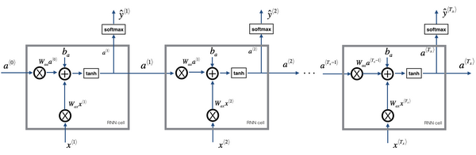

# RNN基础

## 参考资料

【1】吴恩达，deep_learning.ai，第五周第一课，http://www.ai-start.com/dl2017/html/lesson5-week1.html

## 1 循环序列模型

备注：这里用左边图的画法。

## 2 前向传播和后向传播

* 前向传播：

* 示意图：

* 后向传播：

## 3 不同类型的循环神经网络

## 4 语言模型和序列生成

## 5 对新序列采样

## 6 循环神经网络的梯度消失

> 一个很深很深的网络（上图编号4所示），100层，甚至更深，对这个网络从左到右做前向传播然后再反向传播。我们知道如果这是个很深的神经网络，从输出得到 **y^** 的梯度很难传播回去，很难影响靠前层的权重，很难影响前面层（编号5所示的层）的计算。
>

> 对于有同样问题的**RNN**，首先从左到右前向传播，然后反向传播。但是反向传播会很困难，因为同样的梯度消失的问题，后面层的输出误差（上图编号6所示）很难影响前面层（上图编号7所示的层）的计算。这就意味着，实际上很难让一个神经网络能够意识到它要记住看到的是单数名词还是复数名词，然后在序列后面生成依赖单复数形式的**was**或者**were**。
>

> 梯度爆炸很明显，因为指数级大的梯度会让你的参数变得极其大，以至于你的网络参数崩溃。所以梯度爆炸很容易发现，因为参数会大到崩溃，你会看到很多**NaN**。

> 如果你发现了梯度爆炸的问题，一个解决方法就是用梯度修剪。梯度修剪的意思就是观察你的梯度向量，如果它大于某个阈值，缩放梯度向量，保证它不会太大，这就是通过一些最大值来修剪的方法。所以如果你遇到了梯度爆炸，如果导数值很大，或者出现了**NaN**，就用梯度修剪，这是相对比较鲁棒的，这是梯度爆炸的解决方法。