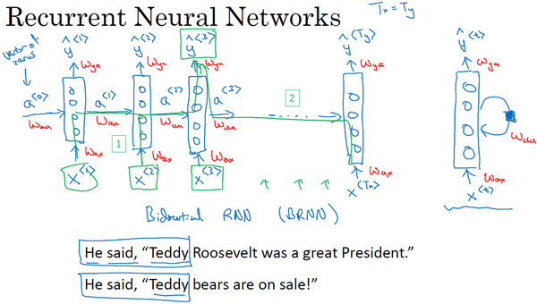
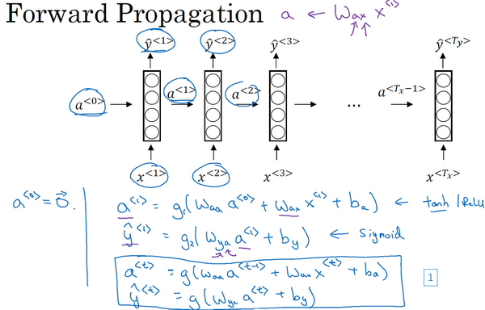

# RNN基础

## 参考资料

【1】吴恩达，deep_learning.ai，第五周第一课，http://www.ai-start.com/dl2017/html/lesson5-week1.html

## 1 循环序列模型

备注：这里用左边图的画法。

## 2 前向传播和后向传播

* 前向传播：

* 示意图：

* 后向传播：

## 3 不同类型的循环神经网络

## 4 语言模型和序列生成

## 5 对新序列采样

## 6 循环神经网络的梯度消失

