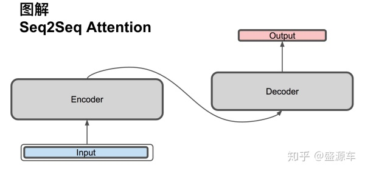
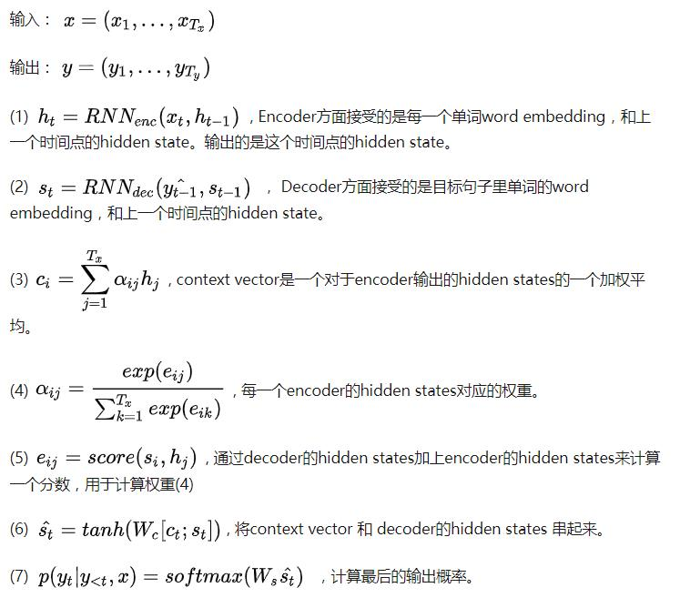
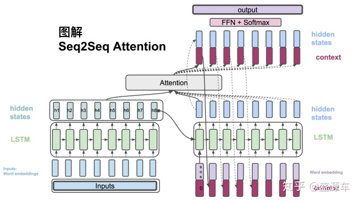
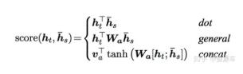
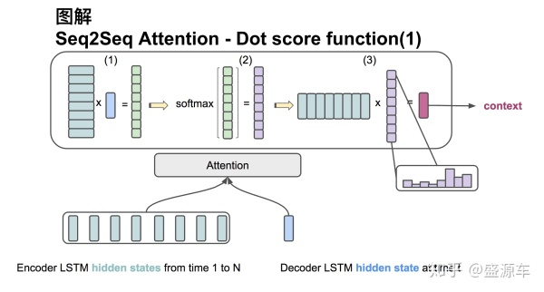
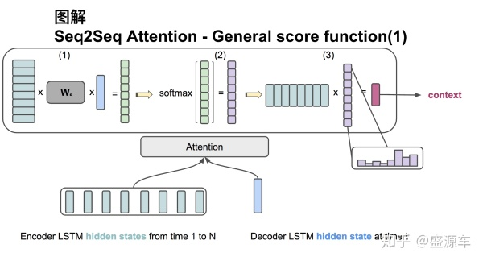

# Attention

## 参考资料

【1】[真正的完全图解Seq2Seq Attention模型 - 盛源车的文章 - 知乎](https://zhuanlan.zhihu.com/p/40920384)

   

## 1 Seq2Seq Attention 

**seq2seq 是**一个Encoder–Decoder 结构的网络，它的输入**是**一个序列，输出也是一个序列， Encoder 中将一个可变长度的信号序列变为固定长度的向量表达，Decoder 将这个固定长度的向量变成可变长度的目标的信号序列。

### 1.1 公式

### 1.2 详细图

### 1.3 Attention

* dot：

* general：

## 2 Multihead Attention

