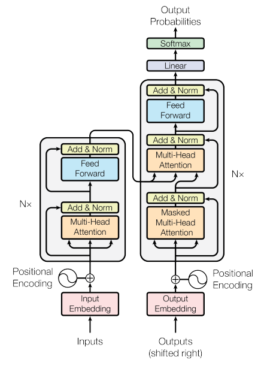
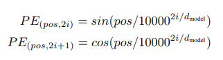
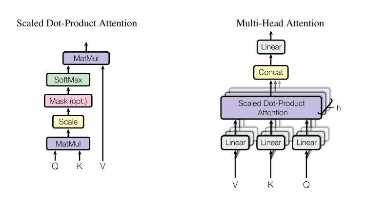
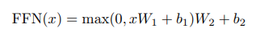
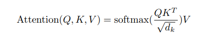
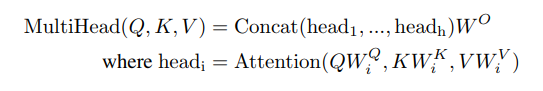

# Transformer

## 参考资料

【1】[Attention is all you need](https://arxiv.org/pdf/1706.03762.pdf)

【2】[Attention和Transformer - Elijha的文章 - 知乎](https://zhuanlan.zhihu.com/p/38485843)

【3】[illustrated-transformer](https://jalammar.github.io/illustrated-transformer/)

## 1 Transformer 结构图

Transformer就是一个升级版的seq2seq，也是由一个encoder和一个decoder组成的；encoder对输入序列进行编码，即 **X=(x0, x1, x2, ..., xTx)** 变成 **H=(h0, h1, h2, ..., hTx)**；decoder对 **H=(h0, h1, h2, ..., hTx)** 进行解码，得到 **Y=(y0, y1, y2, ..., yTy)**。但是神奇的是，encoder和decoder都不用RNN，而且换成了多个attention。

> 1. 左右分别是encoder和decoder。
> 2. enc和dec的底部是embedding；而embedding又分为两部分：**input embedding**和**positional embedding**；其中**input embedding就是seq2seq中的embedding。**而为什么要positional embedding呢？因为transformer中只有attention；回想一下attention，任意一对(query, key)的计算都是完全一样的，不像CNN和RNN，有一个位置或者时序的差异：CNN框住一块区域，随着卷积核移动，边缘的少量点会跟着有序变化；RNN更明显了，不同时序的 **h_t** 和 **s_t** 不同，而且是随着输入顺序不同（正序，倒序）而不同。因此为了体现出时序或者在序列中的位置差异，要对input加入一定的位置信息，即positional embedding。
> 3. enc和dec的中部分别是两个block，分别输入一个序列、输出一个序列；这两个block分别重复 **N** 次。enc的每个block里有两个子网，分别是 **multihead attention** 和 **feedforward network** （ffn）；dec的block里有三个子网，分别是两个 **multihead attention** 和一个 **ffn**。这些子网后面都跟了一个add&norm，即像resnet一样加一个跳边，然后做一个layer norm。
> 4. dec最后还有一个linear和softmax。

## 2 Transformer 详解

### 2.1 positional embedding

每个时刻的xi都是d_model维的，0<=pos<T，0<=i<d。

即对于输入的这个 [T, d_model] 维的tensor，其中的每个标量都有一个独特的编码结果。

### 2.2 multihead attention

> 原始的attention，就是一个query (以下简称Q) 和一组key (以下简称K) 算相似度，然后对一组value (以下简称V) 做加权和；假如每个Q和K都是512维的向量，那么这就相当于在512维的空间里比较了两个向量的相似度. 而multihead就相当于把这个512维的空间人为地拆成了多个子空间, 比如head number=8, 就是把一个高维空间分成了8个子空间, 相应地V也要分成8个head; 然后在这8个子空间里分别计算Q和K的相似度, 再分别组合V. 这样可以让attention能从多个不同的角度进行结合, 这对于NMT是很有帮助的, 因为我们在翻译的时候源语言和目标语言的词之间并不是一一对应的, 而是受很多词共同影响的. 每个子空间都会从自己在意的角度或者因素去组合源语言, 从而得到最终的翻译结果。
>

### 2.3 feedforward network

就是对一个输入序列 **(x_0,x_1, ...,x_T) **，对每个 **x_i**  都进行一次channel的重组：512->1024->512。即为对每个**x_i** 进行两次线性映射。

## 3 Self-Attention

* 获取 Q、K、V

* 计算 Attention（Q，K，V）

* 公式计算：

* Z计算（Attention head #1）：

* Multi-headed Self-Attention 计算：

