# Word2vec

## 参考资料

【1】[word2vec Parameter Learning Explained](https://arxiv.org/pdf/1411.2738.pdf)    
【2】[[NLP] 秒懂词向量Word2vec的本质 - 穆文的文章 - 知乎](https://zhuanlan.zhihu.com/p/26306795)   
【3】[word2vec是如何得到词向量的？ - crystalajj的回答 - 知乎](https://www.zhihu.com/question/44832436/answer/266068967)   

## 1 CBOW 和 Skip-gram 模型对比

- 而如果是拿一个词语的上下文作为输入，来预测这个词语本身，则是 『CBOW 模型』

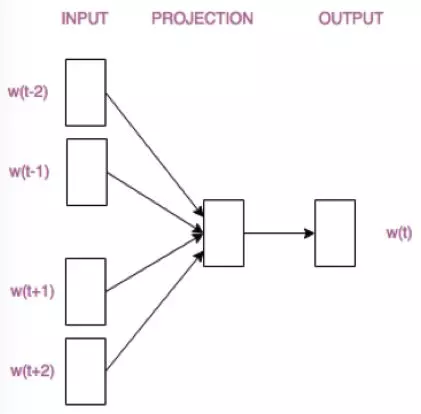

- 如果是用一个词语作为输入，来预测它周围的上下文，那这个模型叫做『Skip-gram 模型』

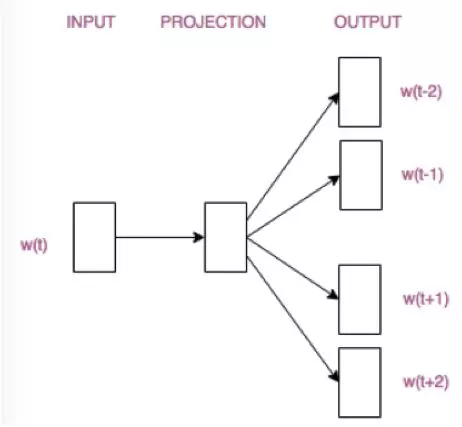

   

## 2 Continuous Bag-of-Word Model (CBOW)

连续词袋模型

### 2.1 One-word context（单个词上下文）

 我们假设每个上下文只考虑一个单词，这意味着模型将在给定一个上下文单词的情况下预测一个目标单词，这就像一个二元模型。

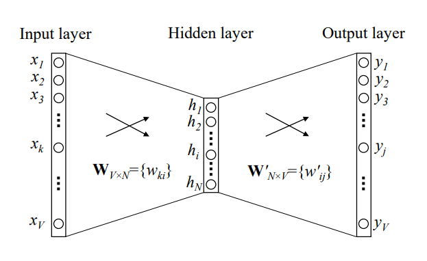

V：vocabulary size；N：hidden layer size

{x1，x2，...，xV}：one-hot encoder 

> 首先说明一点：**隐层的激活函数其实是线性的**，相当于没做任何处理（这也是 Word2vec 简化之前语言模型的独到之处），我们要训练这个神经网络，用**反向传播算法**，本质上是*链式求导*，在此不展开说明了，
>
> 当模型训练完后，最后得到的其实是**神经网络的权重**，比如现在输入一个 x 的 one-hot encoder: [1,0,0,…,0]，对应刚说的那个词语『吴彦祖』，则在输入层到隐含层的权重里，只有对应 1 这个位置的权重被激活，这些权重的个数，跟隐含层节点数是一致的，从而这些权重组成一个向量 vx 来表示x，而因为每个词语的 one-hot encoder 里面 1 的位置是不同的，所以，这个向量 vx 就可以用来唯一表示 x。
>
> **注意：上面这段话说的就是 Word2vec 的精髓！！**

   

### 2.2 Multi-word context（多个词上下文）

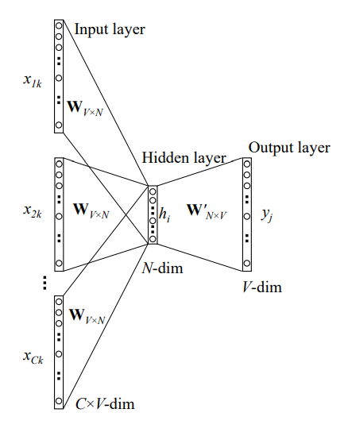

1. 输入层：上下文单词的onehot.  {假设单词向量空间dim为V，上下文单词个数为C}

2. 所有onehot分别乘以共享的输入权重矩阵W. {VN矩阵，N为自己设定的数，初始化权重矩阵W}

3. 所得的向量 {因为是onehot所以为向量} 相加求平均作为隐层向量, size为N1.

   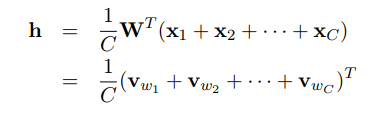

4. 乘以输出权重矩阵W' {NV}

5. 得到向量 {V1} 激活函数处理得到V-dim概率分布  {PS: 因为是onehot嘛，其中的每一维都代表着一个单词}

6. 概率最大的index所指示的单词为预测出的中间词（target word）与true label的onehot做比较，误差越小越好（根据误差更新权重矩阵）

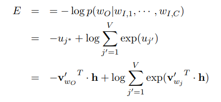

**假设我们此时得到的概率分布已经达到了设定的迭代次数，那么现在我们训练出来的look up table应该为矩阵W。即，任何一个单词的one-hot表示乘以这个矩阵都将得到自己的word embedding。**

   

### 2.3 CBOW模型流程举例

> 假设我们现在的Corpus是这一个简单的只有四个单词的document：
> {I drink coffee everyday}
> 我们选coffee作为中心词，window size设为2
> 也就是说，我们要根据单词"I","drink"和"everyday"来预测一个单词，并且我们希望这个单词是coffee。

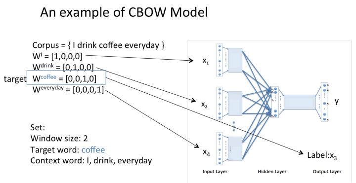

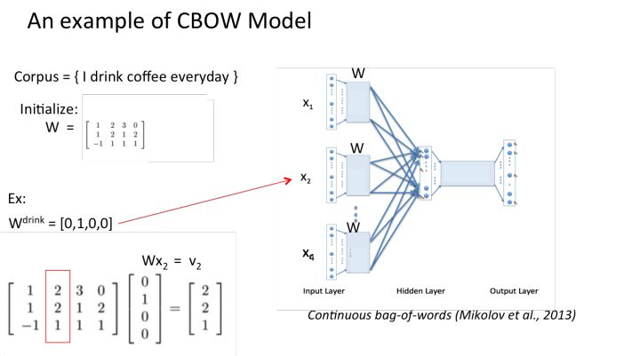

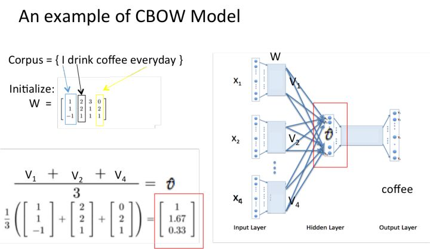

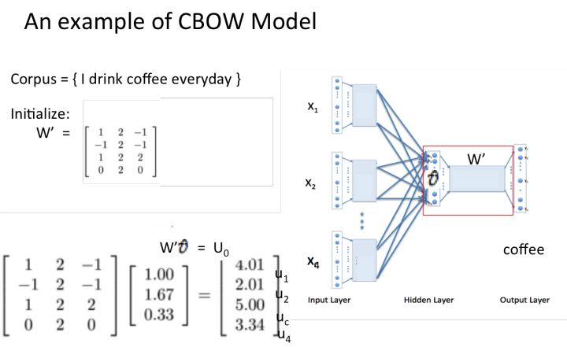

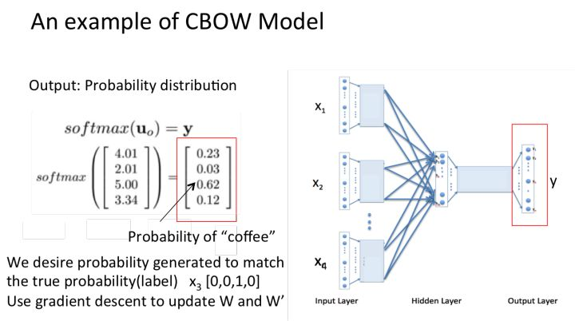

   

## 3 Skip-Gram Model

## 4 Optimizing Computational Efficiency（计算效率优化）

### 4.1 Hierarchical Softmax（分层Softmax）

### 4.2 Negative Sampling（负采样）

