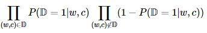

# Word2vec

## 参考资料

【1】[word2vec Parameter Learning Explained](https://arxiv.org/pdf/1411.2738.pdf)    
【2】[[NLP] 秒懂词向量Word2vec的本质 - 穆文的文章 - 知乎](https://zhuanlan.zhihu.com/p/26306795)   
【3】[word2vec是如何得到词向量的？ - crystalajj的回答 - 知乎](https://www.zhihu.com/question/44832436/answer/266068967)   
【4】[全面理解word2vec - Evan的文章 - 知乎](https://zhuanlan.zhihu.com/p/33799633)   

## 1 CBOW 和 Skip-gram 模型对比

- 而如果是拿一个词语的上下文作为输入，来预测这个词语本身，则是 『CBOW 模型』

- 如果是用一个词语作为输入，来预测它周围的上下文，那这个模型叫做『Skip-gram 模型』

   

## 2 Continuous Bag-of-Word Model (CBOW)

连续词袋模型

### 2.1 One-word context（单个词上下文）

 我们假设每个上下文只考虑一个单词，这意味着模型将在给定一个上下文单词的情况下预测一个目标单词，这就像一个二元模型。

V：vocabulary size；N：hidden layer size

{x1，x2，...，xV}：one-hot encoder 

> 首先说明一点：**隐层的激活函数其实是线性的**，相当于没做任何处理（这也是 Word2vec 简化之前语言模型的独到之处），我们要训练这个神经网络，用**反向传播算法**，本质上是*链式求导*，在此不展开说明了，
>
> 当模型训练完后，最后得到的其实是**神经网络的权重**，比如现在输入一个 x 的 one-hot encoder: [1,0,0,…,0]，对应刚说的那个词语『吴彦祖』，则在输入层到隐含层的权重里，只有对应 1 这个位置的权重被激活，这些权重的个数，跟隐含层节点数是一致的，从而这些权重组成一个向量 vx 来表示x，而因为每个词语的 one-hot encoder 里面 1 的位置是不同的，所以，这个向量 vx 就可以用来唯一表示 x。
>
> **注意：上面这段话说的就是 Word2vec 的精髓！！**

   

### 2.2 Multi-word context（多个词上下文）

1. 输入层：上下文单词的onehot.  {假设单词向量空间dim为V，上下文单词个数为C}

2. 所有onehot分别乘以共享的输入权重矩阵W. {VN矩阵，N为自己设定的数，初始化权重矩阵W}

3. 所得的向量 {因为是onehot所以为向量} 相加求平均作为隐层向量, size为N1.

   

4. 乘以输出权重矩阵W' {NV}

5. 得到向量 {V1} 激活函数处理得到V-dim概率分布  {PS: 因为是onehot嘛，其中的每一维都代表着一个单词}

6. 概率最大的index所指示的单词为预测出的中间词（target word）与true label的onehot做比较，误差越小越好（根据误差更新权重矩阵）

**假设我们此时得到的概率分布已经达到了设定的迭代次数，那么现在我们训练出来的look up table应该为矩阵W。即，任何一个单词的one-hot表示乘以这个矩阵都将得到自己的word embedding。**

   

### 2.3 CBOW模型流程举例

> 假设我们现在的Corpus是这一个简单的只有四个单词的document：
> {I drink coffee everyday}
> 我们选coffee作为中心词，window size设为2
> 也就是说，我们要根据单词"I","drink"和"everyday"来预测一个单词，并且我们希望这个单词是coffee。

   

## 3 Skip-Gram Model

## 4 Optimizing Computational Efficiency（计算效率优化）

### 4.1 Hierarchical Softmax（分层Softmax）

对于原始的模型来说，由于使用的是softmax()函数，时间复杂度为 O(|V|)（|V|表示词典的总词数） ，因此计算代价很大，对大规模的训练语料来说，非常不现实。因此Mikolov 提出2个技巧，其中一个是Hierarchical Softmax。

简单来说，Hierarchical Softmax是一种对输出层进行优化的策略，输出层从原始模型的利用softmax计算概率值改为了利用Huffman树计算概率值。

Huffman树是二叉树，在叶子节点及叶子节点的权给定的情况下，该树的带权路径长度最短（一个节点的带权路径长度指根节点到该节点的路径长度乘以该节点的权，树的带权路径长度指全部叶子节点的带权路径长度之和）。直观上可以看出，叶子节点的权越大，则该叶子节点就应该离根节点越近。因此对于模型来说就是，**词频越高的词，距离根节点就越近**。

而一开始我们可以用以词表中的全部词作为叶子节点，词频作为节点的权，构建Huffman树，作为输出。从根节点出发，到达指定叶子节点的路径是唯一的。Hierarchical Softmax正是利用这条路径来计算指定词的概率，而非用softmax来计算。

现在计算输出词为 W 的概率：这对应于一条从根节点 n(w,1) 走到叶子节点 n(w,L(w)) 的路径，概率计算式为下式：

> 所以简单来说，应用Hierarchical Softmax就是把 N 分类问题变成 log(N)次二分类。
> 

​    

### 4.2 Negative Sampling（负采样）

第二种加速策略是Negative Sampling（简写NEG，负采样），这是Noise-Contrastive Estimation（简写NCE，噪声对比估计）的简化版本：把语料中的一个词串的中心词替换为别的词，构造语料 D 中不存在的词串作为负样本。本质上就是一个预测全部分类的变成预测总体类别的子集的方法。在这种策略下，优化目标变为了：最大化正样本的概率，同时最小化负样本的概率。

对于一个词串  （ c 表示 w 的上下文），用二项Logistic回归模型对其是正样本的概率建模：

最大化：

取对数得到对数似然：

