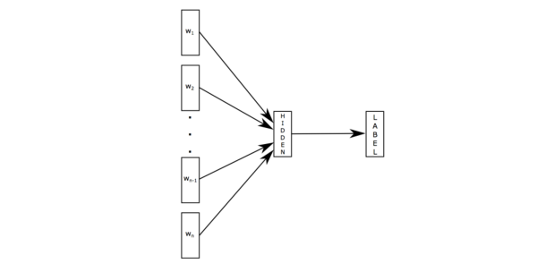
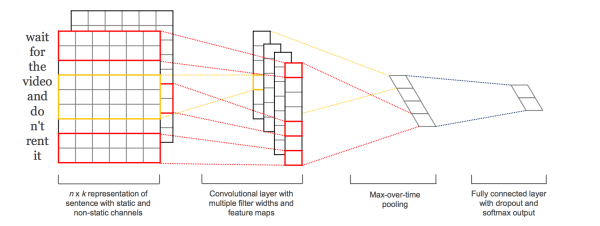
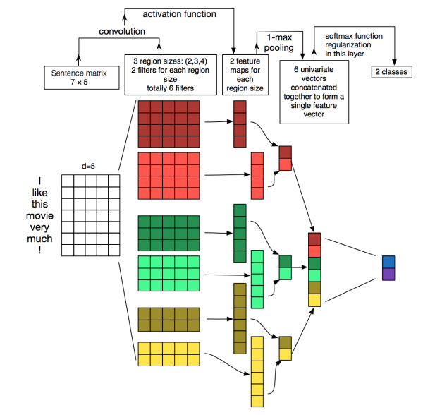
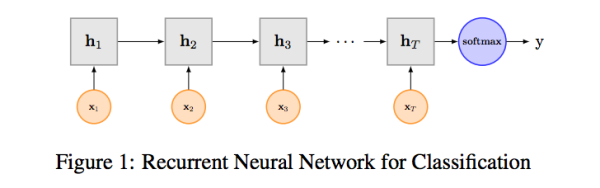
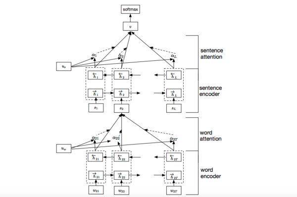
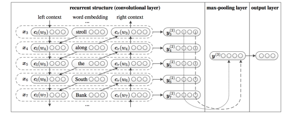

# 文本分类模型

## 参考资料

【1】[用深度学习（CNN RNN Attention）解决大规模文本分类问题 - 综述和实践 - 清凇的文章 - 知乎](https://zhuanlan.zhihu.com/p/25928551)   
【2】[Bag of Tricks for Efficient Text Classification](https://arxiv.org/pdf/1607.01759v2.pdf)   
【3】[Recurrent Neural Network for Text Classification with Multi-Task Learning](https://www.ijcai.org/Proceedings/16/Papers/408.pdf)   
【4】[NEURAL MACHINE TRANSLATION BY JOINTLY LEARNING TO ALIGN AND TRANSLATE](https://arxiv.org/pdf/1409.0473v7.pdf)   
【5】[Hierarchical Attention Networks for Document Classification](https://www.cs.cmu.edu/~diyiy/docs/naacl16.pdf)   

   

## 1 FastText

优点：简单，快速

> 原理是把句子中所有的词向量进行平均（某种意义上可以理解为只有一个avg pooling特殊CNN），然后直接接 softmax 层。

## 2 TextCNN

## 3 TextRNN

## 4 TextRNN + Attention

## 5 TextRCNN（TextRNN + CNN）

