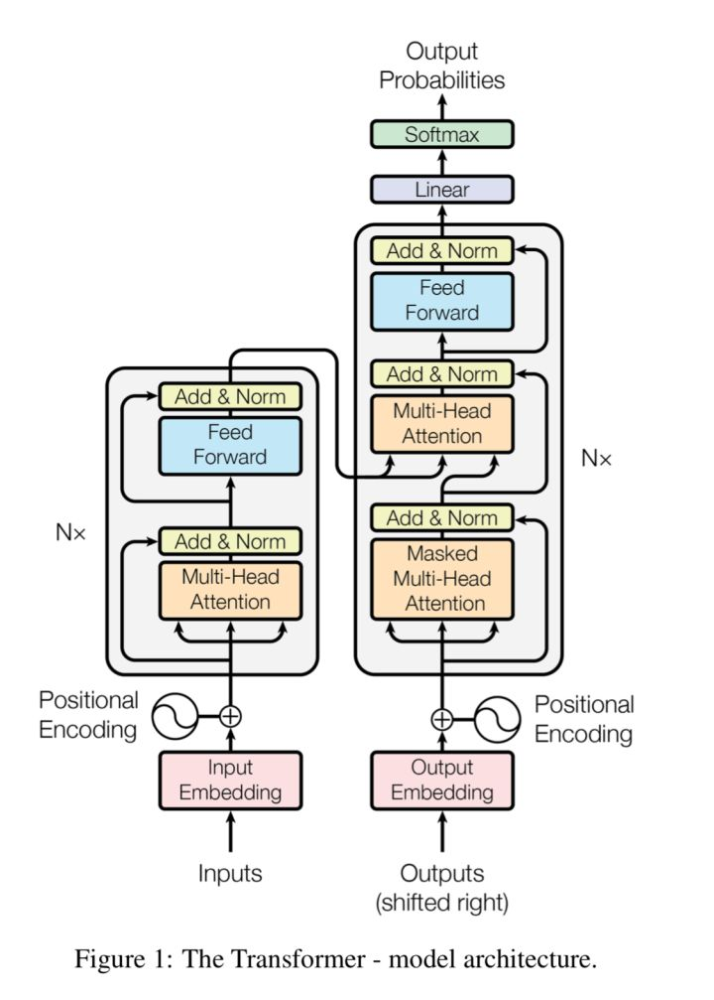
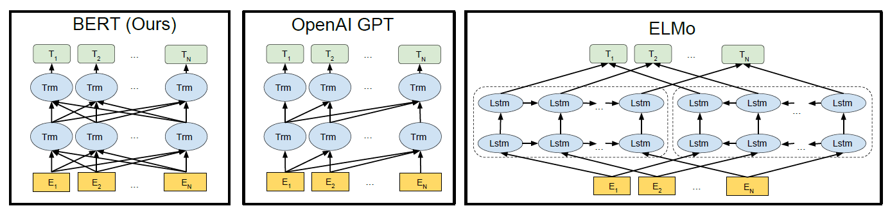
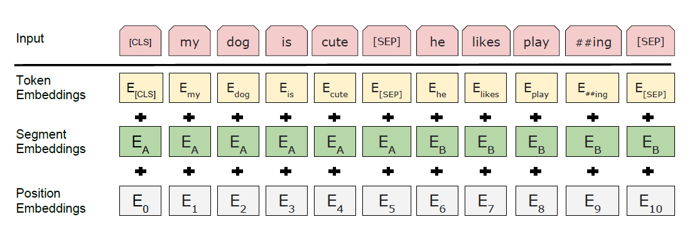
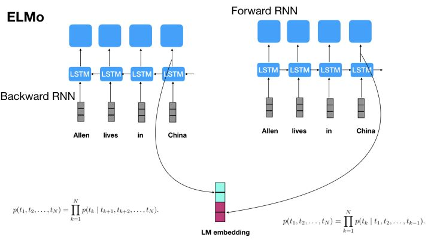
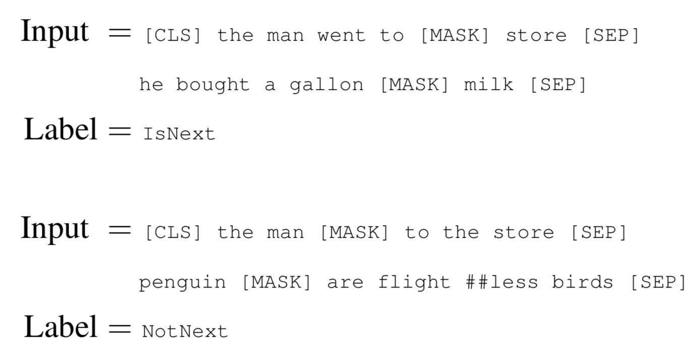
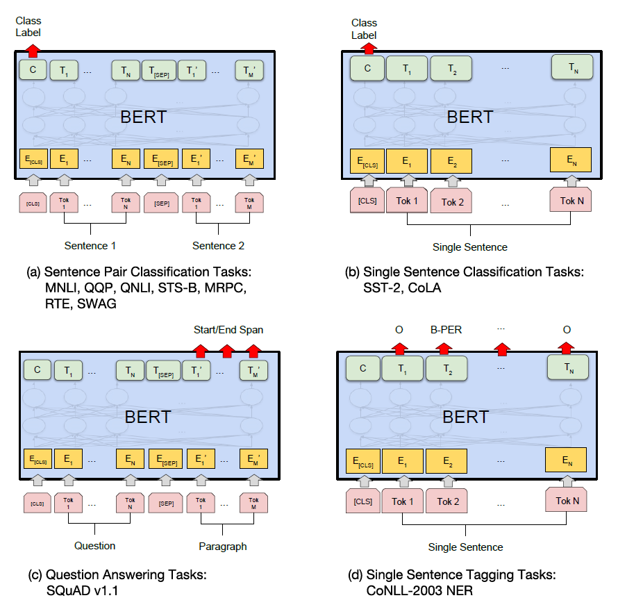
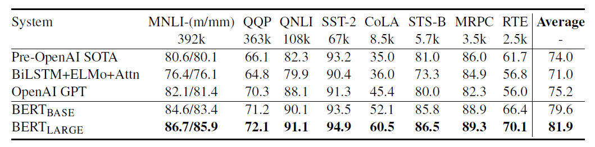

# bert 模型 详解（论文）

[TOC]

## 参考资料：

【1】[BERT: Pre-training of Deep Bidirectional Transformers for Language Understanding](https://arxiv.org/pdf/1810.04805.pdf) 
【2】论文解读:BERT模型及fine-tuning - 习翔宇的文章 - 知乎 https://zhuanlan.zhihu.com/p/46833276
【3】NLP的游戏规则从此改写？从word2vec, ELMo到BERT - 夕小瑶的文章 - 知乎 https://zhuanlan.zhihu.com/p/47488095
【4】Vaswani A, Shazeer N, Parmar N, et al. [Attention is all you need](https://arxiv.org/pdf/1706.03762.pdf)[C]//Advances in Neural Information Processing Systems. 2017: 5998-6008.
【5】GAUSSIAN ERROR LINEAR UNITS (GELUS)  https://arxiv.org/pdf/1606.08415.pdf
* * *
**BERT**全称**B**idirectional **E**ncoder **R**epresentations from **T**ransformers，是预训练语言表示的方法，可以在大型文本语料库（如维基百科）上训练通用的“语言理解”模型，然后将该模型用于下游NLP任务，比如机器翻译、问答等等。


## 1 模型结构

BERT采用了Transformer Encoder的模型来作为语言模型，Transformer模型来自于论文[4], 完全抛弃了RNN/CNN等结构，而完全采用Attention机制来进行input-output之间关系的计算，如下图中左半边部分所示，其中模型包括两个sublayer：

1. Multi-Head Attention 来做模型对输入的Self-Attention
2. Feed Forward 部分来对attention计算后的输入进行变换



L 层数（Transformer blocks），H（hidden size），A（the number of self-attention heads）

* BERT_BASE:    L=12, H=768,   A=12, Total Parameters=110M
* BERT_LARGE: L=24, H=1024, A=16, Total Parameters=340M

BERT模型如下图中左边第一个所示，它与OpenAI GPT的区别就在于采用了Transformer Encoder，也就是每个时刻的Attention计算都能够得到全部时刻的输入，而OpenAI GPT采用了Transformer Decoder，每个时刻的Attention计算只能依赖于该时刻前的所有时刻的输入，因为OpenAI GPT是采用了单向语言模型。



Figure 1: Differences in pre-training model architectures. BERT uses a bidirectional Transformer. OpenAI GPT uses a left-to-right Transformer. ELMo uses the concatenation of independently trained left-to-right and rightto-left LSTM to generate features for downstream tasks. Among three, only BERT representations are jointly conditioned on both left and right context in all layers.


## 2 输入

* Token Embeddings 词向量

* Segment Embeddings 句向量

* Position Embeddings 位置向量

三个embedding进行sum得到输入的向量：   my --> E_my + E_A + E_1

* [CLS] 序列开头

* [SEP] 两个句子中间间隔



Figure 2: BERT input representation. The input embeddings is the sum of the token embeddings, the segmentation embeddings and the position embeddings.


## 3 Pre-training Tasks（预训练任务/预测目标）

### 3.1 Task #1: Masked LM

现有的语言模型的问题在于，没有同时利用到Bidirectional信息，现有的语言模型例如ELMo号称是双向LM(BiLM)，但是实际上是两个单向RNN构成的语言模型的拼接，如下图所示



因为语言模型本身的定义是计算句子的概率：

.png)

前向RNN构成的语言模型计算的是：

forward.png)

也就是当前词的概率只依赖前面出现词的概率。
而后向RNN构成的语言模型计算的是：

backward.png)

也就是当前词的概率只依赖后面出现的词的概率。
那么如何才能同时利用好前面词和后面词的概率呢？BERT提出了Masked Language Model，也就是随机去掉句子中的部分token，然后模型来预测被去掉的token是什么。这样实际上已经不是传统的神经网络语言模型(类似于生成模型)了，而是单纯作为分类问题，根据这个时刻的hidden state来预测这个时刻的token应该是什么，而不是预测下一个时刻的词的概率分布了。
这里的操作是随机mask语料中15%的token，然后预测masked token，那么masked token 位置输出的final hidden vectors喂给softmax网络即可得到masked token的预测结果。

* 80%的时间中：将选中的词用[MASK]token来代替，例如

```
my dog is hairy → my dog is [MASK]
```

* 10%的时间中：将选中的词用任意的词来进行代替，例如

```
my dog is hairy → my dog is apple
```

* 10%的时间中：选中的词不发生变化，例如

```
my dog is hairy → my dog is hairy
```

这样存在另一个问题在于在训练过程中（each batch）只有15%的token被预测，正常的语言模型实际上是预测每个token的，因此Masked LM相比正常LM会收敛地慢一些，后面的实验也的确证实了这一点。
随机替换只作用于1.5%的token（15%*10%），不会对损害模型的理解能力。

### 3.2 Task #2: Next Sentence Prediction

很多需要解决的NLP tasks依赖于句子间的关系，例如问答任务（QA）、自然语言推理（NLI）等，这个关系语言模型是获取不到的，因此将下一句话预测作为了第二个预训练任务。该任务的训练语料是两句话，来预测第二句话是否是第一句话的下一句话，50% 为实际的下一句，50%为语料库的随机句子，如下所示



NotNext为随机选择的句子，最终预训练模型达到了97%-98%的准确度。


## 4 Pre-training Procedure（预训练过程）

预训练的语料库：

* BooksCorpus (800M words) (Zhu et al., 2015) 
* English Wikipedia (2,500M words)（only the text passages and ignore lists, tables, and headers.）

每个样本（Ａ＋Ｂ）：

* A：一段话，长度512，15％的词做mask处理
* B：一段话，长度512，15％的词做mask处理，50%为A实际的下一段语句，50%为随机语句

batch_size 256, 40 epochs

> We train with batch size of 256 sequences (256 sequences * 512 tokens = 128,000 tokens/batch) for 1,000,000 steps, which is approximately 40 epochs over the 3.3 billion word corpus.


模型参数：

> We use Adam with learning rate of 1e-4, 1 = 0:9, 2 = 0:999, L2 weight decay of 0:01, learning rate warmup over the first 10,000 steps, and linear decay of the learning rate. We use a dropout probability of 0.1 on all layers. We use a gelu activation (Hendrycks and Gimpel, 2016) [5] rather than the standard relu, following OpenAI GPT. 


损失函数：mean( likelihood( masked LM ) ) + mean( likelihood( next sentence prediction ) )

> The training loss is the sum of the mean masked LM likelihood and mean next sentence prediction likelihood.


预训练（设备+耗时）：

* BERT_BASE:      4 Cloud TPUs（16 TPU chips total）,  4 days
* BERT_LARGE: 16 Cloud TPUs（64 TPU chips total）,  4 days

> Training of BERTBASE was performed on 4 Cloud TPUs in Pod configuration (16 TPU chips total). 

> Training of BERTLARGE was performed on 16 Cloud TPUs (64 TPU chips total). Each pretraining took 4 days to complete.


## 5 Fine-tuning Procedure（微调步骤，根据实际的任务/预测目标进行模型微调）

> Fine-tuning方式是指在已经训练好的语言模型的基础上，加入少量的task-specific parameters, 例如对于分类问题在语言模型基础上加一层softmax网络，然后在新的语料上重新训练来进行fine-tune。


这里fine-tuning之前对模型的修改非常简单，例如针对sequence-level classification problem(例如情感分析)，取第一个token的输出表示，喂给一个softmax层得到分类结果输出；对于token-level classification(例如NER)，取所有token的最后层transformer输出，喂给softmax层做分类。


> For fine-tuning, most model hyperparameters are the same as in pre-training, with the exception of the batch size, learning rate, and number of training epochs. The dropout probability was always kept at 0.1. The optimal hyperparameter values are task-specific, but we found the following range of possible values to work well across all tasks:

> Batch size: 16, 32

> Learning rate (Adam): 5e-5, 3e-5, 2e-5

> Number of epochs: 3, 4

参数基本不变，只需要设置 batch_size，Adam learning rate，epochs
总之不同类型的任务需要对模型做不同的修改，但是修改都是非常简单的，最多加一层神经网络即可。如下图所示



Figure 3: Our task specific models are formed by incorporating BERT with one additional output layer, so a minimal number of parameters need to be learned from scratch. Among the tasks, (a) and (b) are sequence-level tasks while (c) and (d) are token-level tasks. In the figure, E represents the input embedding, Ti represents the contextual representation of token i, [CLS] is the special symbol for classification output, and [SEP] is the special symbol to separate non-consecutive token sequences.


## 6 Comparison of BERT and OpenAI GPT（模型对比：BERT 和 OpenAI GPT）



Table 1: GLUE Test results, scored by the GLUE evaluation server. The number below each task denotes the number of training examples. The “Average” column is slightly different than the official GLUE score, since we exclude the problematic WNLI set. OpenAI GPT = (L=12, H=768, A=12); BERTBASE = (L=12, H=768, A=12); BERTLARGE = (L=24, H=1024, A=16). BERT and OpenAI GPT are single-model, single task. All results obtained from https://gluebenchmark.com/leaderboard and [https://blog.openai.com/language-unsupervised/ ](https://blog.openai.com/language-unsupervised/).


> • GPT is trained on the BooksCorpus (800M words); BERT is trained on the BooksCorpus (800M words) and Wikipedia (2,500M words).

> • GPT uses a sentence separator ([SEP]) and classifier token ([CLS]) which are only introduced at fine-tuning time; BERT learns [SEP], [CLS] and sentence A/B embeddings during pre-training.

> • GPT was trained for 1M steps with a batch size of 32,000 words; BERT was trained for 1M steps with a batch size of 128,000 words.

> • GPT used the same learning rate of 5e-5 for all fine-tuning experiments; BERT chooses a task-specific fine-tuning learning rate which performs the best on the development set.


除了模型结构不同之外，GPT 和 BERT 还有以下的差别：

* 预训练数据不同：GPT 使用的是 BooksCorpus (800M words)； BERT使用的是 BooksCorpus (800M words) and Wikipedia (2,500M words)
* 预训练 数据处理不同：GPT只在微调时添加了 [SEP], [CLS] 的标识 token；BERT在预训练的时候就添加了 [SEP], [CLS]，并添加了 A/B embeddings 句向量
* 预训练时的 同时样是1M steps，但 batch_size 的 词数不同
* 微调时的 learning rate：GPT 都为 5e-5；BERT 根据验证集选择合适的 learning rate