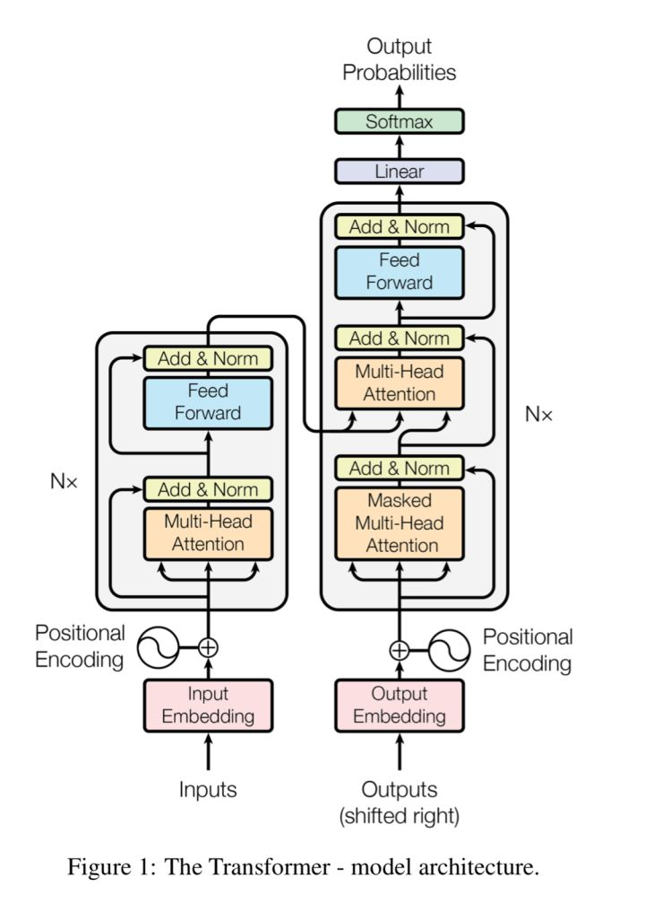

# Attention Is All You Need (note)

## 参考资料

【1】Attention Is All You Need https://arxiv.org/pdf/1706.03762.pdf

【2】论文解读:Attention is All you need - 习翔宇的文章 - 知乎
https://zhuanlan.zhihu.com/p/46990010

## 1 介绍

2017 年，Google 机器翻译团队发表的《Attention is All You Need》中，完全抛弃了RNN和CNN等网络结构，而仅仅采用Attention机制来进行机器翻译任务，并且取得了很好的效果，注意力机制也成为了大家近期的研究热点。

> Attention mechanisms have become an integral part of compelling sequence modeling and transduction models in various tasks, allowing modeling of dependencies without regard to their distance in the input or output sequences. In all but a few cases, however, such attention mechanisms are used in conjunction with a recurrent network.
>
> In this work we propose the Transformer, a model architecture eschewing recurrence and instead relying entirely on an attention mechanism to draw global dependencies between input and output.

## 2 背景 

> The goal of reducing sequential computation also forms the foundation of the Extended Neural GPU, ByteNet and ConvS2S, all of which use convolutional neural networks as basic building block, computing hidden representations in parallel for all input and output positions. In these models, the number of operations required to relate signals from two arbitrary input or output positions grows in the distance between positions, linearly for ConvS2S and logarithmically for ByteNet. This makes it more difficult to learn dependencies between distant positions [12]. In the Transformer this is reduced to a constant number of operations, albeit at the cost of reduced effective resolution due to averaging attention-weighted positions, an effect we counteract with Multi-Head Attention as described in section 3.2.
> Self-attention, sometimes called intra-attention is an attention mechanism relating different positions of a single sequence in order to compute a representation of the sequence. Self-attention has been used successfully in a variety of tasks including reading comprehension, abstractive summarization, textual entailment and learning task-independent sentence representations [4, 27, 28, 22]. End-to-end memory networks are based on a recurrent attention mechanism instead of sequencealigned recurrence and have been shown to perform well on simple-language question answering and language modeling tasks [34].
> To the best of our knowledge, however, the Transformer is the first transduction model relying entirely on self-attention to compute representations of its input and output without using sequencealigned RNNs or convolution. In the following sections, we will describe the Transformer, motivate self-attention and discuss its advantages over models such as [17, 18] and [9].

 the Transformer, motivate self-attention

##  3  Model Architecture （模型架构）

绝大部分的序列处理模型都采用encoder-decoder结构，其中encoder将输入序列 ![(x_1,x_2,...,x_n)]映射到连续表示 ![\vec{z}=(z_1,z_2,...,z_n)] ,然后decoder生成一个输出序列 ![(y_1,y_2,...,y_m)],每个时刻输出一个结果。Transformer模型延续了这个模型，整体架构如下图1所示。

### 3.1 Encoder and Decoder Stacks

* Encoder：编码器由 N=6 个相同的层组成，每层有两个子层，第一个是 multi-head self-attention mechanism，第二个是简单的全连接层。在每个子层，都模拟了残差网络，然后是归一化。
  * 每个子层的输出是 $LayerNorm(x + Sublayer(x))$
  * 为了确保连接，所有的sub-layers和embedding layer输出的维数都相同 $d_{model} = 512$
* Decoder：解码器也是由 N=6 个相同的层组成，每层有三个子层：
  * 第一个是 Masked multi-head self-attention，但是因为是生成过程，因此在时刻 ![i]的时候，大于 ![i]的时刻都没有结果，只有小于 ![i]的时刻有结果，因此需要做Mask
  * 第二个sub-layer是对encoder的输入进行attention计算
  * 第三个sub-layer是全连接网络，与Encoder相同

### 3.2 Attention

Attention通常可以进行如下描述，表示为将query(Q)和key-value pairs ![\left\{ K_i,V_i|i=1,2,...,m \right\}] 映射到输出上，其中query、每个key、每个value都是向量，输出是V中所有values的加权，其中权重是由Query和每个key计算出来的，计算方法分为三步：

第一步：计算比较Q和K的相似度，用f来表示

![f(Q, K_i), i=1,2,...,m\tag{1}]

第二步：将得到的相似度进行Softmax操作，进行归一化

![\alpha_i = \frac{e^{f(Q,K_i)}}{\sum_{j=1}^{m}{f(Q,K_j)}}, i=1,2,...,m\tag{2}]

第三步：针对计算出来的权重 ![\alpha_i] ,对V中所有的values进行加权求和计算，得到Attention向量

![\sum_{i=1}^{m}{\alpha_iV_i}\tag{3}]

通常第一步中计算方法包括以下四种：

- 点乘 dot product

![f(Q,K_i)=Q^TK_i\tag{4}]

- 权重 General

![f(Q,K_i)=Q^TWK_i\tag{5}]

- 拼接权重 Concat

![f(Q,K_i)=W[Q;K_i]\tag{6}]

- 感知器 Perceptron

![f(Q,K_i)=V^T \tanh(WQ+UK_i)\tag{7}]

Figure 2: (left) Scaled Dot-Product Attention. (right) Multi-Head Attention consists of several
attention layers running in parallel.

#### 3.2.1 Scaled Dot-Product Attention

假设输入的query、key维度为 ,value维度为  , 那么就计算query和每个key的点乘操作，并除以  ，然后应用Softmax函数计算权重。

![Attention(Q,K_i,V_i)=softmax(\frac{Q^TK_i}{\sqrt{d_k}})V_i\tag{9}]

在实践中，将query和keys、values分别处理为矩阵 ![Q,K,V] , 那么计算输出矩阵为：

![Attention(Q,K,V)=softmax(\frac{Q^TK}{\sqrt{d_k}})V\tag{10}]

#### 3.2.2 Multi-Head Attention

#### 3.2.3 Applications of Attention in our Model

### 3.3 Position-wise Feed-Forward Networks

### 3.4 Embeddings and Softmax

### 3.5 Positional Encoding

### 
