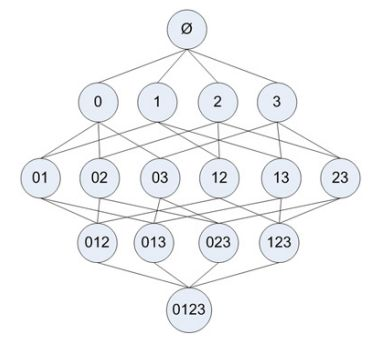
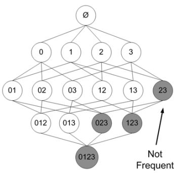
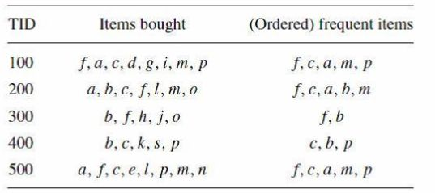
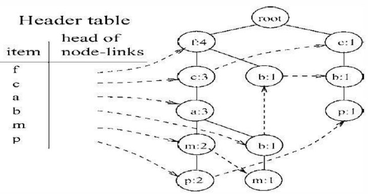
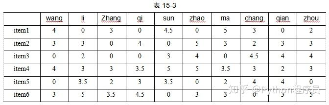
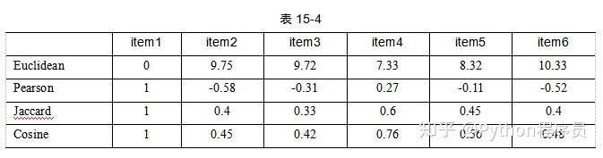
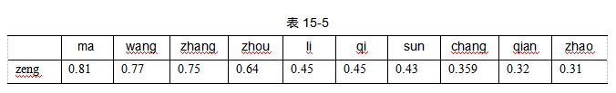
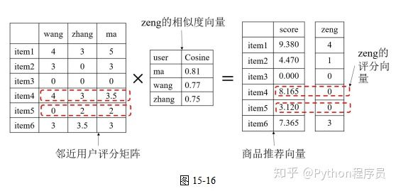
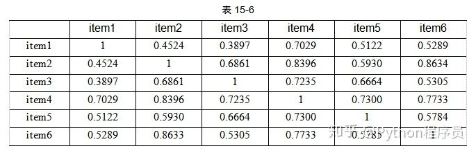
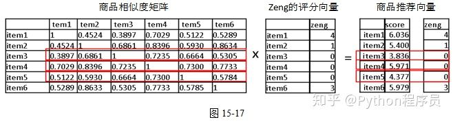

# 推荐算法介绍

## 1 [推荐系统概述](https://zhuanlan.zhihu.com/p/37520503)

 推荐系统可以将商品推荐给用户，在互联网领域有着广泛运用。推荐系统可以根据应用、设计目的、使用的数据和推荐方法的不同进行分类。

1. 基于应用，推荐系统可以分为电子商务推荐、社交好友推荐、搜索引擎推荐、信息内容推荐等。

2. 基于设计目的，推荐系统可以分为协同过滤、内容的推荐、知识的推荐、混合推荐。
3. 基于使用的数据的推荐以及推荐系统可以分为基于用户行为数据的推荐、基于用户标签的推荐、基于社交网络数据、基于上下文信息（时间上下文、地点上下文等）的推荐。
4. 基于推荐方法，推荐系统可以分为基于用户需求的推荐、基于购物篮的推荐、基于用户商品的推荐、基于用户相似性的推荐、基于市场细分的推荐等。

**基于推荐方法**

- 基于用户需求的推荐

 这类推荐的算法主要是分类模型，比如Logistic回归、神经网络等。这类推荐根据用户的属性、行为数据对用户的需求进行建模，进而预测用户的（购买等）行为，由于其需要训练数据，因此只适用于有销售记录的产品，而且这类算法的建模过程比较复杂。

- 基于购物篮的推荐

 这类推荐的算法的典型代表为关联规则，其用于发现不同商品被同时购买的规则，从而反映了顾客的需求模式，其适用于有销售记录的商品，可以向老客户推荐相关商品。

- 基于用户/商品的推荐

 基于用户（User）和商品（Item）的推荐统称为协同过滤，该方法通过对用户/商品购买或评价矩阵的转换，获取用户与用户或商品与商品的相似性。一般用户较多的电商会使用基于商品的推荐，而社交网站更偏爱基于用户的推荐。这类方法也会使用到奇异值分解算法进行稀疏矩阵的存储。

- 基于用户相似性的推荐

 这类推荐是以用户之间的相似性为基础，典型算法就是各种相似度的计算、KNN算法以及基于用户的协同过滤，其可以找出有相似行为的用户并向他们推荐产品。其一般适用于有过购买行为的老用户，而且推荐的产品也不能是全新的产品。

- 基于市场细分的推荐

 市场细分以k-means算法为代表，相似的用户具有相似的需求，其可以适用于全新的产品，全新的用户，但是模型效果只能事后检验。

## 2 推荐算法介绍（基于推荐方法划分）

| 推荐类别                 | 采用的算法                      | 数据                             | 目的                                 |
| ------------------------ | ------------------------------- | -------------------------------- | ------------------------------------ |
| 基于**用户需求**的推荐   | 分类算法                        | 用户属性、用户行为数据、产品属性 | 用户未来是否购买                     |
| 基于**购物篮**的推荐     | 关联规则                        | 销售数据                         | 不同商品被同时购买的规则             |
| 基于**用户/商品**的推荐  | 协同过滤                        | 用户购买商品的评价               | 用户与用户或商品与商品的相似性       |
| 基于**用户相似性**的推荐 | 相似性、KNN、基于用户的协同过滤 | 用户属性、用户行为数据           | 找出有相似行为的用户并向他们推荐产品 |
| 基于**市场细分**的推荐   | 聚类                            | 用户属性、用户行为数据、产品属性 | 全新的产品，全新的用户的推荐         |

### 2.1 分类算法

- 数据：通过用户属性（消费水平、性别、年龄等）、商品属性（分类、价格、 标签或描述词、店铺信息等）、消费记录（用户购买商品流水），预测用户未来某个时间 可能购买什么商品，商品推荐（点击购买转换率提升）。

- 算法：Logistics回归、分类决策树、ffm分类等
- 说明：需要做特征工程（机器学习算法）、不需要太多特征工程（神经网络），需要某段时间内大量的流水数据来分析预测

### 2.2 关联规则

#### 2.2.1 概念

- 事务库（Transaction Database）：存储着二维结构的记录集。定义为：D 
  就好比一份超市销售记录，列是商品ID，行是每个人的购买记录，每个格子中存的是这个人是否购买了该商品。
- 事务（Transaction）：在事务库里的某一笔事务。定义为：T，T ∈ D
  举例来说就是某一位客户的购买记录。
- 支持度（Support）：定义为 S(X) = occur(X) / count(D) = P(X)
  比如啤酒的支持度为3%，意思就是在该资料库中有3%的顾客购买了啤酒。
- 置信度（Confidence/Strength）： 定义为 C(X->Y) = S(X ∪ Y) / S(X) = P(Y|X)
  如果C(啤酒→尿布)=40%，意思就是在购买啤酒的顾客中，有40%的人同时也购买了尿布
- 项集(Items)：同时出现的项的集合。定义为：k-itemset（k项集）
  比如{啤酒}、{尿不湿}就是1项集，{啤酒，尿不湿}这样的组合就是2项集。
- 候选集（Candidate itemset）：通过向下合并（Join）得出的项集。定义为C[k]
- 频繁集（Frequent itemset）：支持度大于等于支持度阈值（Minimum Support/minsup）的项集。表示为L[k]。注意，频繁集的子集一定是频繁集。

#### 2.2.2 算法

 Apriori核心算法步骤描述如下：

1. 找出所有频繁1项集的集合，该集合记作L[1]，令k=1；
2. 连接步：在L[k]的基础上，通过向下合并得到候选k+1项集，记作C[k+1]；
3. 剪枝步：在C[k+1]中，任一项集的所有非空子集也必须是频繁的，剔除不符合的，得到L[k+1]；
4. 令k=k+1，重复2->3，直到不能生成更大的频繁集为止。

#### 2.2.3 举例

 某超市购物的消费清单：

| 顾客 | 购物清单                       |
| ---- | ------------------------------ |
| A    | 巧克力，花                     |
| B    | 口香糖，可乐，剃须刀，花       |
| C    | 巧克力，花                     |
| D    | 巧克力，可乐，剃须刀，奶粉，花 |
| E    | 巧克力，啤酒                   |
| F    | 口香糖，剃须刀，洗手液         |
| G    | 可乐，洗手液                   |
| H    | 可乐，保温杯                   |
| I    | 啤酒，尿不湿                   |
| J    | 洗发水                         |

 我们先定义一个支持度阈值为30%，如果低于这个阈值的项集就会被剔除。

 那么我们先通过这个顾客的购物清单来计算『C1候选集』：

| C1     |        |
| ------ | ------ |
| 商品   | 支持度 |
| 口香糖 | 20%    |
| 巧克力 | 40%    |
| 可乐   | 40%    |
| 剃须刀 | 30%    |
| 洗手液 | 20%    |
| 花     | 40%    |
| 洗发水 | 10%    |
| 尿不湿 | 10%    |
| 啤酒   | 20%    |

 方法很简单，就是统计每个商品出现的频率而已，然后我们将大于支持度阈值30%的『1项集』挑选出来成为『L1频繁集』（上图黄色高亮部分即为L1）。

然后我们通过『L1频繁集』来构造『C2候选集』，『C2候选集』即是『L1频繁集』中的『1项集』俩俩组合产生的，如下所示：

| C2             |        |
| -------------- | ------ |
| 商品           | 支持度 |
| 巧克力，可乐   | 10%    |
| 巧克力，花     | 30%    |
| 巧克力，剃须刀 | 10%    |
| 可乐，剃须刀   | 20%    |
| 可乐，花       | 20%    |
| 剃须刀，花     | 20%    |

 **在C2中找出所有满足阈值条件的『2项集』，只有{巧克力，花}这么唯一一组『2项集』，那么算法就到此结束了。** 如果每个步骤不去掉非频繁项目集，则其扫描过程的树形结构如下，每个数字可以理解为是某一种商品：

在其中某个过程中，可能出现非频繁的项目集，将其去掉（用阴影表示）为：

#### 2.2.4 提升

 回到算法本身，很容易就能发现这个算法的瓶颈在于当事务库变得十分庞大的时候，每次计算候选集会带来很大的时间开销，如果不加以优化，那么每次都得遍历每条事务中的每一个节点上的数据才能完成支持度计算这步操作。好了，那么问题就是如何针对关联规则挖掘来做优化呢？

 这是一个比较有意思的问题，因为学术界和工业界在这个问题上往往会选择两种截然不同的策略。

 对于学术派来说，优化时间复杂度是第一要事，所以FP-Growth算法应运而生，发明者采用了一种分治策略将提供频繁项集的事务库压缩到一棵频繁模式树（FP-Tree），但仍保留了项集关联信息。如果有比较扎实数据结构基础的话，你很快就会发现它就是一棵长得比较另类的前缀树，由频繁项头表和项前缀树构成，每一条路径表示了一组可行解。通过不断迭代FP-Tree即可找到所有频繁项集。

 FP-Growth是一种比Apriori更高效的频繁项挖掘方法，它只需要扫描项目表2次。其中第1次扫描获得当个项目的频率，去掉不符合支持度要求的项，并对剩下的项排序。第2遍扫描是建立一颗FP-Tree(frequent-patten tree)。接下来的工作就是在FP-Tree上进行挖掘。

 它所对应的FP-Tree如下：

 然后从频率最小的单项P开始，找出P的条件模式基，用构造FP-Tree同样的方法来构造P的条件模式基的FP-Tree，在这棵树上找出包含P的频繁项集。

 依次从m, b, a, c, f的条件模式基上挖掘频繁项集，有些项需要递归的去挖掘，比较麻烦，比如m节点，具体的过程可以参考博客：[Frequent Pattern 挖掘之二(FP Growth算法)](https://link.zhihu.com/?target=http://blog.sina.com.cn/s/blog_68ffc7a40100uebg.html)，里面讲得很详细。

### 2.3 相似性

- 数据：对于某种商品，用户对于该商品的评分、投票、某文章或微博的转发、点击量、页面停留的时间等可以反映用户偏好。评分、投票、转发等可以比较精确地得到用户对于该商品的偏好信息；而点击量、页面停留则含有噪声，需要对这类数据事先进行处理；对于用户评论，则需要进行文本分析来得知用户的情感倾向，从而可以一定程度地反映用户的偏好。
- 度量方法：相似度的度量有很多方法，这里介绍欧氏距离（Euclidean），皮尔森相似度（Pearson）、余弦相似度（Cosine）与杰卡德距离（Jaccard）。
- 举例：在得到每个用户的偏好后，就可以进一步分析用户之间的相似情况。以一个超市数据为例，这个超市收集了*N*个用户购买*M*个商品后的评价记录，数据如表15-3所示。

**其中，列表示某用户，行表示某商品，单元格内的分数代表用户对商品的偏好（评分）。**现在用户wang对6种商品评分为4、3、0、4、0、3，需要找出与该用户最相似的前三个用户。

 对于相似度计算方法，这里以欧氏距离、皮尔森距离、杰卡德距离、余弦距离为例对相似度进行计算。可以看到在欧氏距离下，用户zhang、用户ma、用户zhou与用户wang的距离最近即他们之间相似度比较高。在皮尔森相似度下，用户wang与用户ma、用户zhang、sun比较相似；在杰卡德相似度下，用户wang与用户ma、用户zhou比较相似；在余弦相似度下，用户wang与用户ma、用户zhang和用户zhou相似度较高。

 四种相似度计算方式的结果比较相似。

 **通过相似度的计算，就找到了相似的用户，从而可以进行下一步的推荐。相似度高的用户会购买某些商品。**

 除了计算用户相似度，数据集同样也可以使用相同的方法计算商品的相似度，以item1为例，计算出的相似情况如表15-4所示。

 从表中可以看出，四种相似度在计算商品相似度时，最相似的商品计算出来也都非常一致。

 1 与4、5 相似度高。

### 2.4 协同过滤

#### 2.4.1 基于用户的协同过滤

根据用户对商品的偏好找到相似的邻近用户，然后将邻近用户喜欢的商品推荐给当前用户。

协同过滤在计算上，就是将一个用户对所有商品的偏好作为一个向量用以计算用户之间的相似度，找到K个相似用户，然后根据相似用户的相似度权重以及他们对商品的偏好，预测当前用户没有偏好的未涉及商品，计算得到一个排序的物品列表作为推荐。（相似性的应用？）

 对于新用户zeng，其对6个商品的打分为4、1、0、0、0、3，通过余弦距离计算出用户zeng与其他用户的距离从小到大排序表15-5所示。

 取前三个用户为邻近用户，即用户ma、用户wang、用户zhang。此时以每个邻近用户的相似度为权重，以相应物品的评分为值，进行相乘，计算出商品推荐打分。例如，对于zeng未打分而其他用户打过分的商品item4，其商品推荐打分计算为：

​                                                        item4 = 4*0.81 + 3*0.77 + 3.5*0.75 = 8.175

 同理，可以计算出所有商品的推荐打分，以矩阵形式写出，如图15-16所示。

 显然，根据计算出的商品推荐打分向量，应该向用户zeng首先推荐item4，然后推荐item5。

#### 2.4.2 基于商品的协同过滤

基于商品的协同过滤和基于用户的原理类似，只是在计算相似度时采用商品本身，而不是从用户的角度，即基于用户对商品的偏好找到相似的商品，然后根据用户的历史偏好，推荐相似的商品给他。

从计算的角度看，就是将所有用户对某个商品的偏好作为一个向量用以计算商品之间的相似度，得到某商品的相似商品后，根据用户历史的偏好预测当前用户还没有表示偏好的商品，计算得到一个排序的商品列表作为推荐。

 对于新用户zeng，其对6个商品的打分为4、1、0、0、0、3，计算出6个商品的余弦距离矩阵，如表15-6所示。

 这个矩阵便是商品的相似度矩阵，基于商品的协同过滤会以商品的相似度为权重，在本例中以用户zeng的商品打分为基础，计算商品推荐打分，例如用户zeng未打分的商品item3，其计算公式应为

 新用户zeng，其对6个商品的打分为4、1、0、0、0、3

 同理，可以计算出所有商品的推荐打分，以矩阵形式写出，如图15-17所示。

 因此，基于商品的协同过滤会依次向用户zeng推荐商品item4、item5和item3。

#### 2.4.3 两种协同过滤的比较

对于电子商务，用户数量一般远超过商品数量，此时基于商品的协同过滤计算复杂度较低。

 在非社交网络的网站中，内容内在的联系是很重要的推荐原则，它比基于相似用户的协同过滤更加有效。比如在购书网站上，当你在看一本书时，推荐引擎会向你推荐相关的书籍，这个推荐的重要性远远超过了网站首页对该用户的综合推荐。可以看到在这种情况下，基于商品的协同过滤成为引导用户浏览的重要手段。基于商品的协同过滤算法，是目前电子商务最广泛使用的推荐算法。

 基于商品的协同过滤的缺点是倾向于推荐热门商品，在长尾推荐方面不够强大；从用户体验的角度上看，缺少惊喜的体验。

 在社交网络或者新闻媒体类网站中，基于用户的协同过滤更为适用，一方面这类网站每天都会产生大量的新内容；另一方面，这类协同过滤加上社会网络信息，可以增加用户对推荐解释的信服程度。但基于用户的协同过滤要求用户有比较多的好友，因此更适用于社交属性站点。

### 2.5 聚类

 对与新用户或者新的商品，以上规则类可能不适用。

根据用户属性或商品属性，销售记录进行聚类，对新用户或新商品分类，划分类别推荐。

## 3 总结

### 3.1 规则类（不需要验证）

#### 3.1.1 基于用户（协同过滤）

 根据用户的评分记录，寻找相似度高的用户，根据相似度权重，计算出用户未购买商品的得分，根据大小向用户推荐商品。

#### 3.1.2 基于商品（协同过滤）

 计算商品之间的相似度，然后根据用户购买的商品评分，对未购买商品进行评分推荐。

#### 3.1.3 基于购买记录（关联规则）

 根据购买记录， 设定支持度，得到不同商品被同时购买的规则。

### 3.2 算法类

#### 3.2.1 分类

 根据用户属性、商品属性、销售记录等，预测用户未来的购买倾向。

#### 3.2.2 聚类

 根据用户属性或商品属性，销售记录等，对用户或商品聚类，根据新用户或新商品的属性，划分类别推荐。