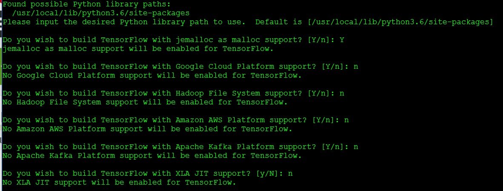

# tensorflow-cpu 编译

 官网说明：

https://www.tensorflow.org/install/install_sources

## **1 更新**

```shell
$ apt-get update && apt-get upgrade
```

## **2 安装 add-apt-repository**

```shell
$ apt-get install software-properties-common
```

## **3 安装 java8**

```shell
$ add-apt-repository ppa:webupd8team/java  
$ apt-get update && apt-get install oracle-java8-installer
$ java -version
```

 返回：

```shell
java version "1.8.0_191"
Java(TM) SE Runtime Environment (build 1.8.0_191-b12)
Java HotSpot(TM) 64-Bit Server VM (build 25.191-b12, mixed mode)
```

## **4 安装 Bazel**

```shell
$ echo "deb [arch=amd64] http://storage.googleapis.com/bazel-apt stable jdk1.8" | tee /etc/apt/sources.list.d/bazel.list
$ curl https://bazel.build/bazel-release.pub.gpg | apt-key add -
$ apt-get update && apt-get install bazel
$ bazel version
```

## **5 下载 tensorflow**

```shell
$ apt install git
# 指定目录 ~/
$ cd ~/
$ git clone https://github.com/tensorflow/tensorflow.git
```

 检出1.11版本

```shell
$ git checkout r1.11
```

 检查配置

```shell
$ ./configure
# 回车-Y-n-n-n-n-n-n-n-...
# 选项 jemalloc、Google Cloud、Hadoop、Amazon AWS、AKP、XLA JIT、VERBS、nGraph、OpenGL、CUDA、MPI、Android
# 如果有显卡，需要在 CUDA 选择Y
```



## 6 编译源文件

> **需要耗费大量CPU资源，默认多线程，cpu满载**

```shell
# CPU
$ bazel build --config=opt //tensorflow/tools/pip_package:build_pip_package
# GPU
$ bazel build --config=opt --config=cuda //tensorflow/tools/pip_package:build_pip_package
```

> **仅支持 CPU 的 TensorFlow**。如果您的系统没有 NVIDIA® GPU，请编译并安装此版本。请注意，这一版本的 TensorFlow 通常更易于编译和安装，因此即使您拥有 NVIDIA GPU，我们也建议您先编译并安装此版本。

> **支持 GPU 的 TensorFlow**。TensorFlow 程序在 GPU 上运行的速度通常要比在 CPU 上快得多。因此，如果您的系统具有 NVIDIA GPU，并且您需要运行性能至关重要的应用，则最终应该编译并安装此版本。除了 NVIDIA GPU 之外，您的系统还必须满足以下相应文档中介绍的 NVIDIA 软件要求：

> [在 Ubuntu 上安装 TensorFlow](https://www.tensorflow.org/install/install_linux#NVIDIARequirements)

## **7 保存编译好的文件**

```shell
# 指定保存目录 ~/tensorflow_pkg
$ mkdir ~/tensorflow_pkg
$ bazel-bin/tensorflow/tools/pip_package/build_pip_package  ~/tensorflow_pkg
$ cd ~/tensorflow_pkg
$ ls
```

## **8 安装 whl 并测试**

 安装

```shell
# tensorflow-1.11.0-cp36-cp36m-linux_x86_64.whl 编译好的文件
$ pip install ./tensorflow-1.11.0-cp36-cp36m-linux_x86_64.whl 
```

 测试

```shell
$ python/python3
# Python 中输入
import tensorflow as tf
hello = tf.constant('Hello, TensorFlow!')
sess = tf.Session()
print(sess.run(hello))
```

